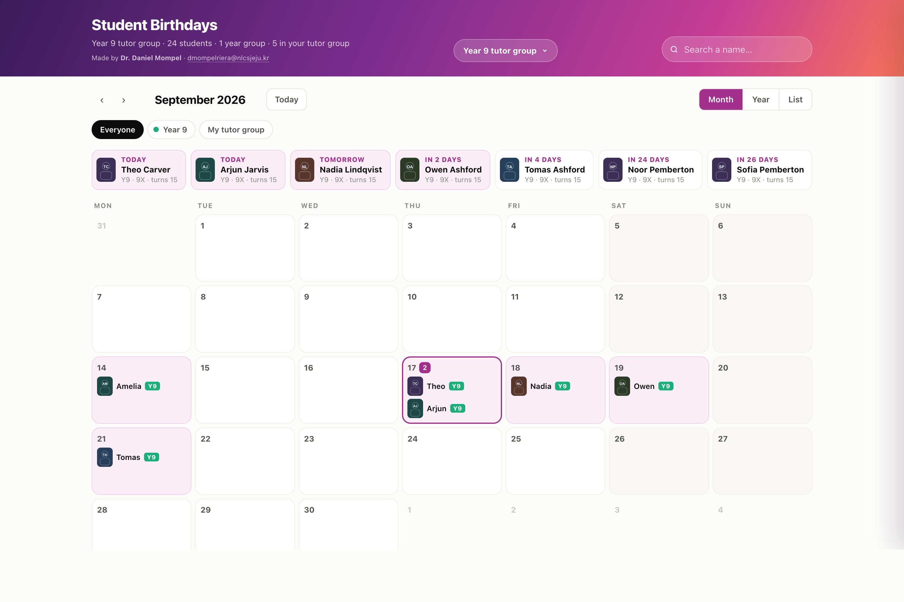

# Birthday Reminder

Your students' birthdays, and a window that finds you instead of the other way round.

> ## ⚠️ You need iSAMS
>
> This is built around exports from **iSAMS**, the school management system. **If your school does
> not use iSAMS, this will not work** — there is nowhere for it to get your class from.
>
> The photographs are the part that cannot be replaced: they come out of the iSAMS **Student ID
> Badge** report, and nothing else produces that file.
>
> If your school runs a different MIS it *may* still manage the names and dates of birth — the reader takes an
> Excel file and looks for `Surname` and `Forename` columns, accepting the usual variants
> (`Last Name`, `Given Name`, `Known As`, `Date of Birth`, `Form`, `Tutor Group`, `House`). That
> route is untested against anything but iSAMS, and it will not bring the photographs with it.
>
> Please check this before you spend time downloading it.

Wishing a fourteen-year-old a happy birthday costs nothing and lands more than most things a teacher
does that week. The reason it does not happen is never that you did not care — it is that nobody
told you in time. This is a small Mac app whose whole job is to tell you, in the morning, before the
lesson, without you remembering to go and look.

*Every name and face above is invented — the screenshot was taken with a made-up tutor group.*

## What it does

- **It comes to you.** It checks when you log in, and within five minutes of you opening the lid —
  which is the one that matters. Once you have seen it in the morning, it leaves you alone for the
  rest of the day.
- **It knows what counts as morning.** Seeing it at 00:05 because you were still working does not
  count; it shows again on your first lid-open after 6am.
- **Friday covers the weekend,** so you can say it to their face on the Friday rather than three
  days late.
- **It catches up.** If the Mac was shut over a birthday, it tells you when you next open it.
- **A calendar to look at properly** — by month, by year, or as a list; searchable; filtered to a
  year group or to your own tutor group.
- **Preferred names.** One panel, every student, a box for what you actually call them. It saves as
  you type. This is the panel to open the week the school publishes its new lists.

## Discreet mode — the feature to know about

If the app notices a second display or mirroring — a projector, in other words — it shows a plain
card saying *"1 birthday to see"*, with no name and no photograph until you click. A birthday
reminder that puts a child's face on the board in front of thirty people is worse than no reminder
at all. It is on by default, and it is `DISCREET_MODE` in the settings file if you want it always
on, or off.

## Settings you can actually change

`config.conf` is a plain text file of commented settings — the time before which nothing is shown,
how long the Mac must be idle before it waits for you to come back, whether weekend birthdays roll
onto Friday, how many days it looks back after the Mac has been off, which browser it opens in.
Edit, save, done. **Updating the app never overwrites it**; new settings are added to the bottom.

## Privacy

- **Everything stays on your Mac.** A local server on `127.0.0.1`, a random port, a token made at
  launch. No account, no cloud, no telemetry, no outbound request.
- **Your students are a folder you can open**: `Profiles/<class>/students.csv` and a `photos/`
  folder. Readable, backup-able, deletable in the Finder.
- **Two Macs keep separate memories** of what they have already shown you, so seeing it on the
  laptop does not silence the desktop.
- **This repository contains no pupil data.** The screenshot is an invented tutor group, and
  `Profiles/` is ignored by git so a real one cannot be committed by accident. The generated
  `Birthday Calendar.html` is not in the repository either — it is built on your machine from your
  own CSV.

## Installing

Download the repository (**Code ▸ Download ZIP**), keep the folder together — Documents is fine —
and double-click `Install.command`.

macOS will block it the first time, because the app is not signed by a paid Apple developer account.
That is expected, and `READ ME FIRST.html` walks through the three clicks past it
( ▸ System Settings ▸ Privacy & Security ▸ **Open Anyway**). Once only.

To put it on a second Mac, copy the folder across and run `Install.command` there too.

If you move the folder afterwards, run `Install.command` again — the background job points at
wherever the folder was when you installed it.

`Uninstall.command` removes the Desktop icon and the background job. Your students stay.

## What the three apps are

| App | What it is |
|---|---|
| **Birthday Reminder** | the background job that decides when to show you the window |
| **Student Birthdays** | the calendar you open yourself |
| **Import Students** | reads your iSAMS exports into a profile |

## Requirements

- **iSAMS** — see the notice at the top. The **Export Wizard** file carries the names and dates of
  birth; the **Student ID Badge** report carries the photographs. Choose **Excel** whenever iSAMS
  offers you a format.
- **macOS.** Built from Swift and Python, both already on your Mac: nothing to install first,
  nothing to keep up to date.

## Made by

Dr Daniel Mompel Riera, Biology, NLCS Jeju — <dmompelriera@nlcsjeju.kr>

Free for any school to use, change, and pass on.
